# Pretina V2 — System Design

> A comprehensive technical reference for the Pretina platform architecture, data models, security design, and operational flows.

---

## Table of Contents

1. [High-Level Architecture](#1-high-level-architecture)
2. [Component Interaction Map](#2-component-interaction-map)
3. [Authentication & Authorization Flow](#3-authentication--authorization-flow)
4. [Payment Flow](#4-payment-flow)
5. [Order Lifecycle](#5-order-lifecycle)
6. [Push Notification Pipeline](#6-push-notification-pipeline)
7. [Media Upload Pipeline](#7-media-upload-pipeline)
8. [Database Schema (ERD)](#8-database-schema-erd)
9. [API Architecture](#9-api-architecture)
10. [Security Model](#10-security-model)
11. [Infrastructure & Deployment](#11-infrastructure--deployment)
12. [Future Roadmap](#12-future-roadmap)

---

## 1. High-Level Architecture

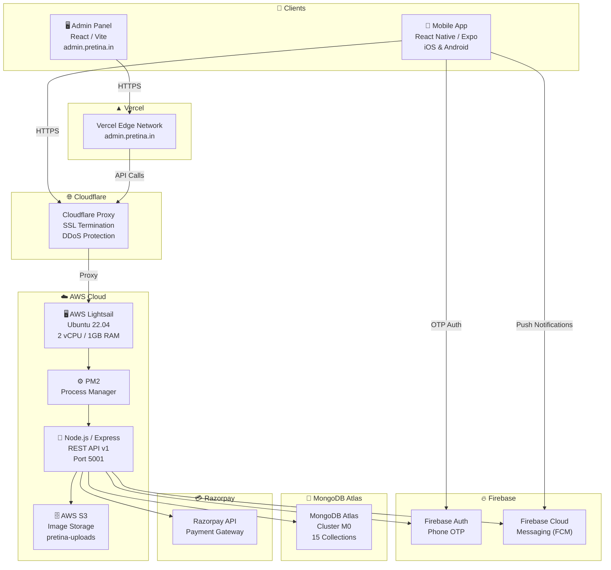

---

## 2. Component Interaction Map

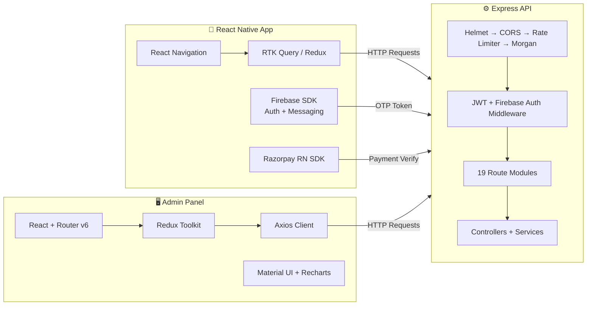

---

## 3. Authentication & Authorization Flow

### 3.1 Phone OTP Login (New & Returning Users)

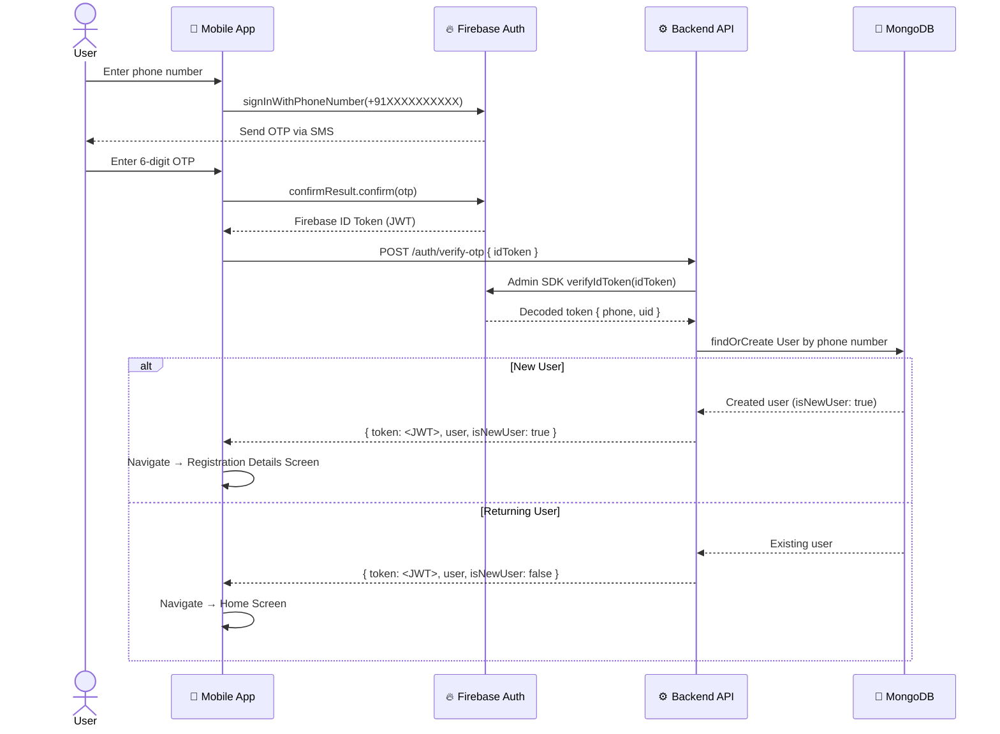

### 3.2 Role-Based Access Control (RBAC)

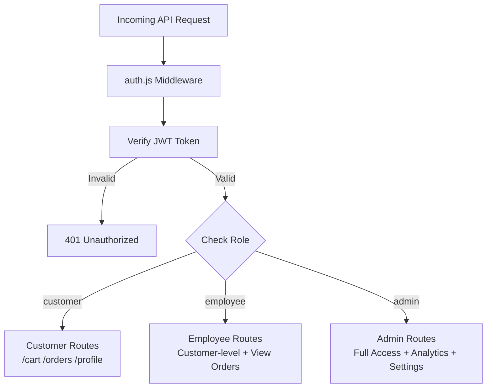

| Role | Access Level |
|---|---|
| `customer` | Own profile, cart, orders, payments |
| `employee` | Customer-level + view/manage orders |
| `admin` | Full access — all CRUD + analytics + settings + employee management |

---

## 4. Payment Flow

### 4.1 Full Razorpay Payment Flow

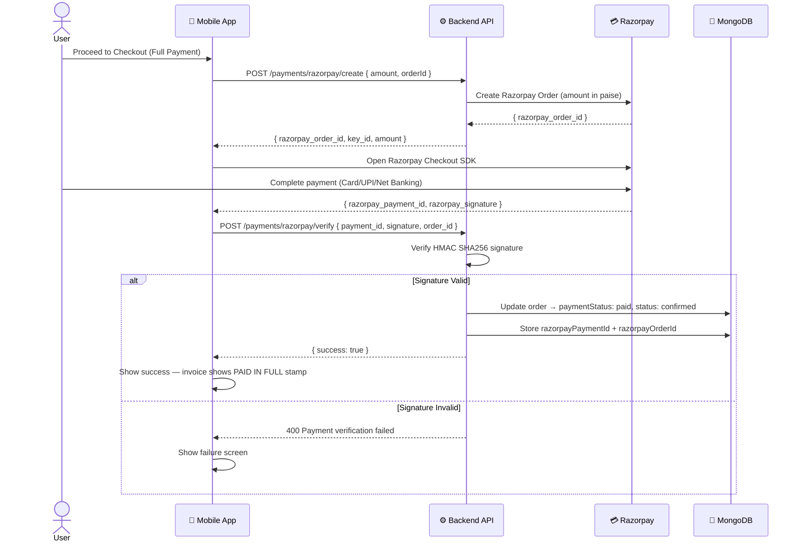

### 4.2 Partial Razorpay (Advance) Payment Flow

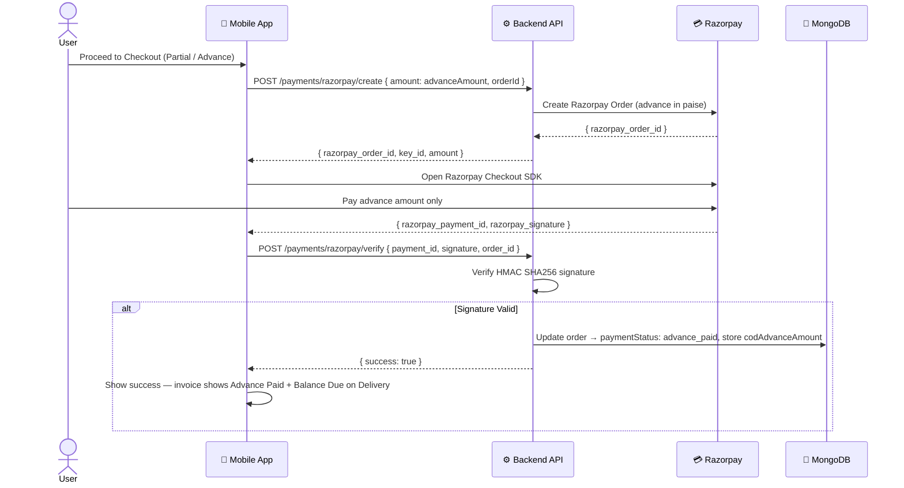

### 4.3 COD (Cash on Delivery) Flow

```mermaid
graph LR
    CHECKOUT["User places COD order"] --> METHOD{"Payment Method"}
    METHOD --> |Full COD| CONFIRM["Order confirmed instantly\npaymentStatus: paid"]
    METHOD --> |Partial COD\n(advance via UPI/QR)| QR_PAY["Pay advance amount"]
    QR_PAY --> MANUAL["Admin manually confirms advance receipt"]
    MANUAL --> CONFIRM2["Order confirmed\npaymentStatus: advance_paid"]
    CONFIRM --> DISPATCH["Order dispatched"]
    CONFIRM2 --> DISPATCH
    DISPATCH --> DELIVERED["Remaining balance collected on delivery"]
```

---

## 5. Order Lifecycle

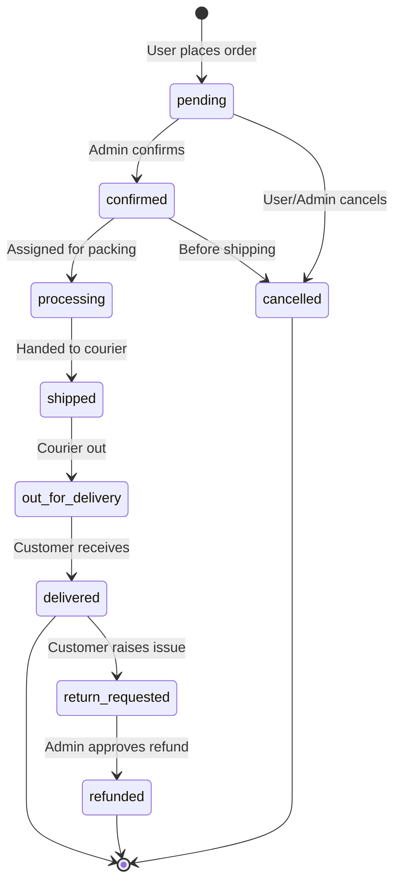

---

## 6. Push Notification Pipeline

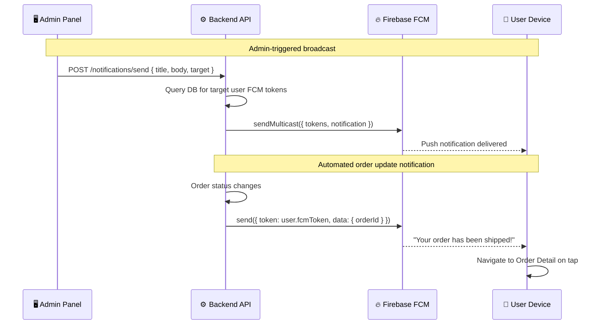

---

## 7. Media Upload Pipeline

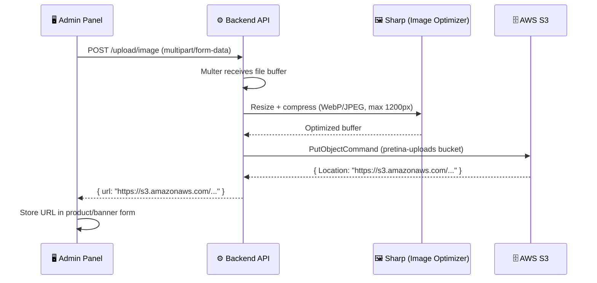

---

## 8. Database Schema (ERD)

### Core Entities

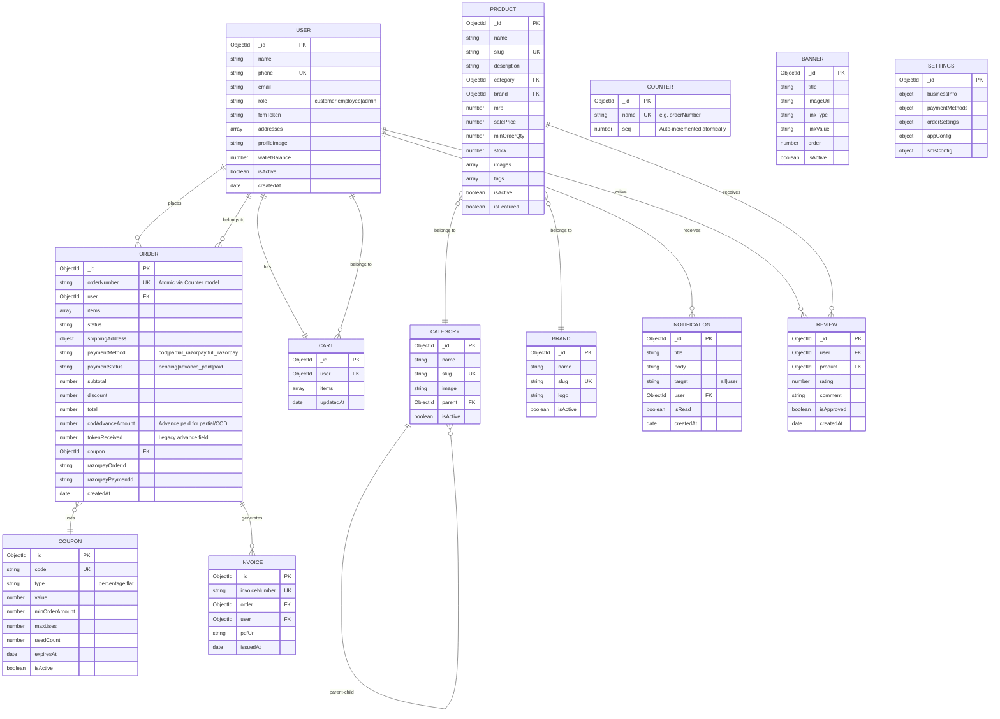

---

## 9. API Architecture

### Middleware Stack (Request Pipeline)

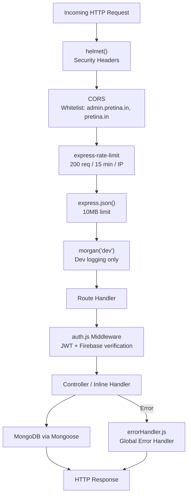

### Route Modules Overview

| Module | Route | Auth Required | Admin Only |
|---|---|---|---|
| `auth` | `/api/v1/auth` | Partial | No |
| `users` | `/api/v1/users` | ✅ | Partial |
| `products` | `/api/v1/products` | Partial | CRUD only |
| `categories` | `/api/v1/categories` | Partial | CRUD only |
| `brands` | `/api/v1/brands` | Partial | CRUD only |
| `orders` | `/api/v1/orders` | ✅ | Partial |
| `cart` | `/api/v1/cart` | ✅ | No |
| `payments` | `/api/v1/payments` | ✅ | No |
| `coupons` | `/api/v1/coupons` | ✅ | CRUD only |
| `banners` | `/api/v1/banners` | Partial | CRUD only |
| `notifications` | `/api/v1/notifications` | ✅ | Send only |
| `analytics` | `/api/v1/analytics` | ✅ | ✅ |
| `employees` | `/api/v1/employees` | ✅ | ✅ |
| `invoices` | `/api/v1/invoices` | ✅ | Partial |
| `reviews` | `/api/v1/reviews` | Partial | Moderate only |
| `settings` | `/api/v1/settings` | ✅ | ✅ |
| `upload` | `/api/v1/upload` | ✅ | ✅ |
| `alerts` | `/api/v1/alerts` | ✅ | ✅ |
| `blogs` | `/api/v1/blogs` | Partial | CRUD only |

---

## 10. Security Model

### Defence-in-Depth Layers

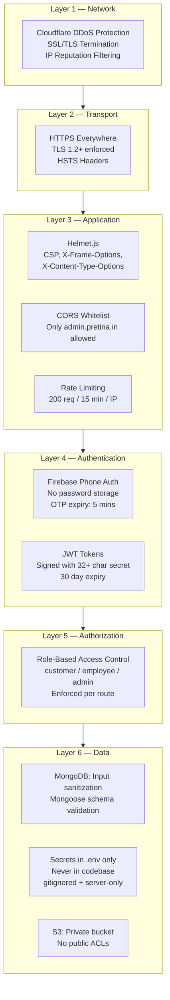

### Security Checklist

| Control | Status |
|---|---|
| All traffic over HTTPS | ✅ |
| No passwords stored (OTP-only) | ✅ |
| JWT signed with strong secret | ✅ |
| Role-based route protection | ✅ |
| Security headers (Helmet) | ✅ |
| CORS restricted to known origins | ✅ |
| Rate limiting enabled | ✅ |
| No secrets in codebase | ✅ |
| `.env` gitignored on all packages | ✅ |
| Firebase service account gitignored | ✅ |
| Google services files gitignored | ✅ |
| User can delete their own account | ✅ (GDPR) |
| S3 bucket not publicly accessible | ✅ |
| Input validation via Mongoose schemas | ✅ |
| Payment signature verification (HMAC) | ✅ |

---

## 11. Infrastructure & Deployment

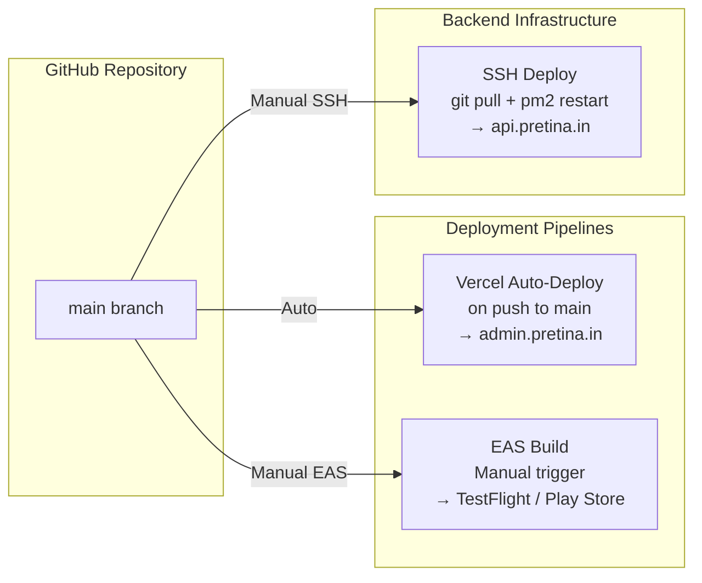

### Server Specs

| Component | Spec |
|---|---|
| Provider | AWS Lightsail |
| OS | Ubuntu 22.04 LTS |
| Instance | 2 vCPU, 1 GB RAM |
| Process Manager | PM2 (cluster mode) |
| Reverse Proxy | Cloudflare (Flexible SSL for app/API, Full SSL via Page Rules for PHP website) |
| API Port | 5001 |
| Domain | `api.pretina.in` |

### DNS Architecture (Cloudflare)

| Subdomain | Type | Target | Notes |
|---|---|---|---|
| `pretina.in` | A | `162.241.123.12` | Client's PHP website (webhostbox hosting) |
| `www.pretina.in` | CNAME | `pretina.in` | Alias for PHP website |
| `admin.pretina.in` | CNAME | Vercel Edge | Admin panel via Vercel |
| `api.pretina.in` | A | AWS Lightsail IP | Backend API |
| `mail.pretina.in` | A | `162.241.123.12` | Client email (DNS only, not proxied) |

> **Note:** Cloudflare Page Rules are configured to apply **Full SSL** only to `pretina.in/*` and `www.pretina.in/*` to fix the PHP website's redirect loop, while the app and API remain on **Flexible SSL**.

### PM2 Configuration

```bash
# View running processes
pm2 status

# Restart backend after deploy
pm2 restart all

# View logs
pm2 logs

# Auto-start on server reboot
pm2 startup
pm2 save
```

---

## 12. Future Roadmap

### Short Term (v1.1)
| Feature | Status | Description |
|---|---|---|
| Product Variants | ✅ Done | Colour/size selector in app with quantity controls |
| Partial Razorpay Payment | ✅ Done | Pay advance via Razorpay, balance on delivery |
| Atomic Order Numbers | ✅ Done | Counter collection prevents duplicate order numbers |
| Invoice PAID Stamp | ✅ Done | PDF shows PAID/Balance Due based on payment status |
| Double-tap Order Guard | ✅ Done | useRef guard prevents duplicate orders on rapid tap |
| Wishlist | 🔜 Planned | Save products for later |
| Advanced Filters | 🔜 Planned | Filter by price range, brand, rating |
| Order Returns | 🔜 Planned | In-app return request flow |
| Referral System | 🔜 Planned | User referral codes with wallet rewards |

### Medium Term (v2.0)
| Feature | Description |
|---|---|
| Vendor/Supplier Portal | Multi-vendor support for product listing |
| Inventory Management | Automatic stock deduction on order |
| Loyalty Points | Points earned per purchase, redeemable at checkout |
| B2B Credit | Credit limit and deferred payment for business buyers |
| Regional Language Support | Hindi + regional language UI |

### Long Term (v3.0)
| Feature | Description |
|---|---|
| AI Product Recommendations | Personalized feed based on purchase history |
| Route Optimization | Delivery route planning for in-house logistics |
| Warehouse Management | Multi-warehouse inventory tracking |
| ERP Integration | SAP / Tally sync for accounting |
| White-Label App | Configurable multi-tenant platform |

---

## Contributing

1. Fork the repository
2. Create a feature branch: `git checkout -b feat/your-feature-name`
3. Commit your changes: `git commit -m "feat: add your feature"`
4. Push to your branch: `git push origin feat/your-feature-name`
5. Open a Pull Request against `main`

Please ensure:
- No secrets or credentials in any committed file
- Environment variables documented in `.env.example`
- Code follows existing patterns (Express MVC, RTK for state)

---

*Last updated: July 2026 | Pretina V2.0 — App v1.0.21*
